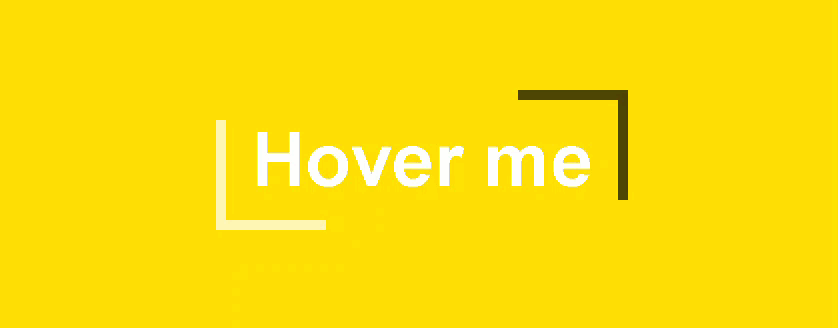
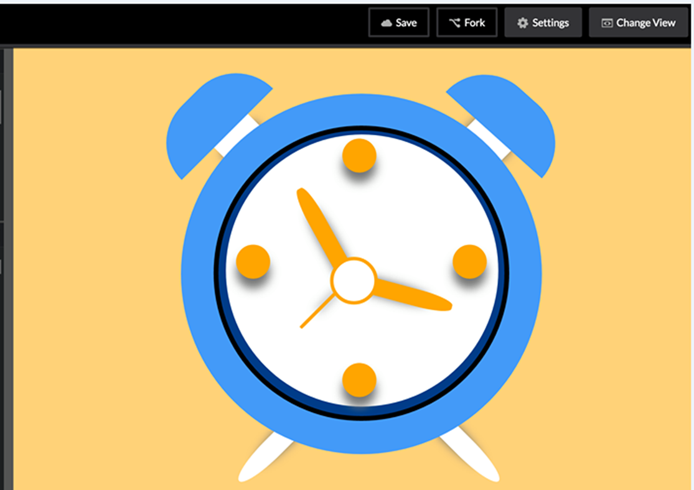

# Frontend-Training-Tasks-Part-2

### This repository describes part 2 of Starting point Front-end Training Tasks,  You will find part 1 & the other parts in <a href="https://github.com/Sh0aib-Ja0allah?tab=repositories">my GitHub Profile</a>.

## To Run this part and see the results follow link :  https://sh0aib-ja0allah.github.io/Frontend-Training-Tasks-Part-2/

## Task #4: 

Please find the attached Gif image hover-me.gif and implement a similar button that changes its style on hover.

## Task #5: 

Please follow this workout https://codepen.io/mikemang/post/a-beginner-s-guide-to-pure-css-images as reference to build this image purely by CSS and HTML (No JavaScript):

### Thanks.
